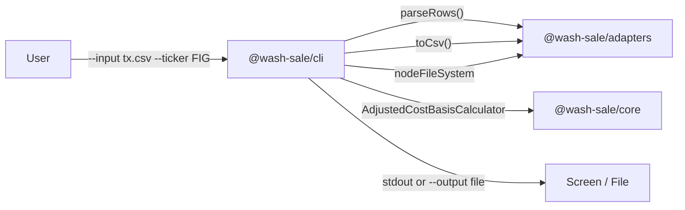

# Wash Sale Calculator CLI Wrapper

## Architecture

Add a new package `packages/cli` to the existing monorepo at `misc-tools/wash-sale-calculator/`. It will depend on `@wash-sale/core` and `@wash-sale/adapters` for parsing, calculation, and serialization.




## CLI Interface

```
wash-sale calculate --input <file> --ticker <ticker> [--output <file>] [--audit <file>] [--positions <file>] [--format table|csv]
```

**Flags:**

- `--input` / `-i` (required): path to input CSV file
- `--ticker` / `-t` (required): stock ticker symbol (e.g. "FIG")
- `--output` / `-o` (optional): path to write Form 8949 CSV output
- `--audit` / `-a` (optional): path to write audit log CSV
- `--positions` / `-p` (optional): path to write remaining positions CSV
- `--format` / `-f` (optional, default "table"): output format for stdout -- "table" for human-readable, "csv" for machine-readable

When no output flags are given, print a human-readable summary to stdout including: summary totals, Form 8949 rows, remaining positions, and any warnings.

## Key Files to Create

All under `misc-tools/wash-sale-calculator/packages/cli/`:

- **[package.json](misc-tools/wash-sale-calculator/packages/cli/package.json)** -- deps on `@wash-sale/core`, `@wash-sale/adapters`, `yargs`; devDeps `@types/yargs`, `typescript`; `bin` field pointing to `dist/main.js`
- **[tsconfig.json](misc-tools/wash-sale-calculator/packages/cli/tsconfig.json)** -- extends `../../tsconfig.base.json`, same pattern as adapters package
- **[src/main.ts](misc-tools/wash-sale-calculator/packages/cli/src/main.ts)** -- entry point: yargs setup with `scriptName('wash-sale')`, `demandCommand(1)`, `strict()`, registers the `calculate` command
- **[src/commands/calculate.ts](misc-tools/wash-sale-calculator/packages/cli/src/commands/calculate.ts)** -- the `calculate` command definition with option flags and handler logic
- **[src/formatters.ts](misc-tools/wash-sale-calculator/packages/cli/src/formatters.ts)** -- functions to format `CalculationResult` as human-readable console output (summary table, form 8949 rows, remaining positions, warnings) and CSV serializers for audit log and remaining positions

## Files to Modify

- **[pnpm-workspace.yaml](pnpm-workspace.yaml)** -- already covers `misc-tools/wash-sale-calculator/packages/`* via the glob, so no change needed
- **[misc-tools/wash-sale-calculator/package.json](misc-tools/wash-sale-calculator/package.json)** -- add `typecheck` entry for the new package in the `tsc --build` list

## Implementation Details

### Entry point (`src/main.ts`)

Follow the test-cli pattern from `integration-test/test-cli/src/main.ts`:

```typescript
#!/usr/bin/env node
import yargs from "yargs";
import { calculateCommand } from "./commands/calculate";

async function main(): Promise<void> {
  const args = process.argv.slice(2);
  const parser = yargs.scriptName("wash-sale");
  calculateCommand(parser);
  await parser
    .demandCommand(1, "Please provide a command.")
    .strict()
    .wrap(Math.min(120, yargs.terminalWidth()))
    .parseAsync(args);
}

main().catch((error) => {
  console.error(error);
  process.exit(1);
});
```

### Calculate command (`src/commands/calculate.ts`)

Handler flow:

1. Read input CSV via `nodeFileSystem.readText(argv.input)`
2. Parse with `parseRows(csvText)`
3. Run `AdjustedCostBasisCalculator.forTicker(argv.ticker).addRows(rows).calculate()`
4. If `--output` provided: write Form 8949 CSV via `nodeFileSystem.writeText()`
5. If `--audit` provided: serialize audit log to CSV and write via `nodeFileSystem.writeText()`
6. If `--positions` provided: serialize remaining positions to CSV and write via `nodeFileSystem.writeText()`
7. If no output flags: print formatted summary to stdout

### Console formatter (`src/formatters.ts`)

Format `CalculationResult` for human consumption:

- **Summary** section with gain/loss totals
- **Form 8949** table with columns aligned
- **Remaining Positions** table
- **Warnings** list (if any)

Use simple column-aligned output (pad strings) rather than pulling in a table library to keep dependencies minimal.

### CSV serializers for `--audit` and `--positions`

**Audit log CSV columns:** `eventId`, `type`, `at`, `rowKey`, `saleRowKey`, `lotFragmentId`, `relatedFragmentId`, `message`

**Remaining positions CSV columns:** `fragmentId`, `ticker`, `source`, `sharesOpen`, `purchaseDateActual`, `acquisitionDateAdjusted`, `originalBasisPerShare`, `basisPerShareAdjusted`

These are new serializers in `formatters.ts` (the existing `toCsv` in adapters only handles Form 8949 output).

### Bin script

The `package.json` will have `"bin": { "wash-sale": "dist/main.js" }`. For local dev, a `bin/wash-sale` script (like test-cli's pattern) will use `tsx` to run the source directly:

```bash
#!/usr/bin/env node
require("tsx");
require("../src/main.ts");
```

