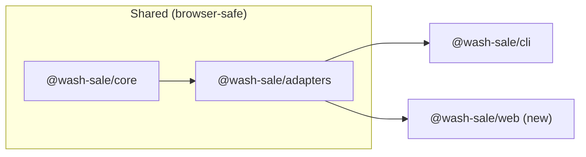

# Wash Sale Static HTML Calculator

## Architecture

The CLI currently owns all formatting logic in `[packages/cli/src/formatters.ts](misc-tools/wash-sale-calculator/packages/cli/src/formatters.ts)`. The core engine (`@wash-sale/core`) and CSV parser (`@wash-sale/adapters`) are already environment-agnostic -- only the formatters and `fs-node.ts` are Node-specific. We will:

1. Extract the shared formatters from CLI into adapters (the ANSI terminal codes stay in CLI)
2. Create a new `packages/web` package that bundles everything into a static HTML page via esbuild




## Phase 1: Extract formatters from CLI to adapters

Move the environment-agnostic formatting logic from `[packages/cli/src/formatters.ts](misc-tools/wash-sale-calculator/packages/cli/src/formatters.ts)` into `[packages/adapters/src/formatters.ts](misc-tools/wash-sale-calculator/packages/adapters/src/)` and re-export from the adapters index.

**What moves to adapters (ANSI-free):**

- `escapeCsvValue`, `padRight` (helpers)
- `formatForm8949Table`, `formatInputTable`, `formatAuditTable` (table renderers)
- `formatResultTable` (main composer) -- with a plain-text disclaimer (no ANSI escape codes)
- `formatAuditCsv`, `formatPositionsCsv` (CSV serializers)
- `FormatOptions` interface

**What stays in CLI:**

- A thin wrapper that re-exports everything from adapters
- Overrides `formatResultTable` to inject ANSI-colored disclaimer text before calling the shared version, OR simply wraps the output by prepending the ANSI disclaimer

Approach for the disclaimer: add an optional `disclaimerOverride?: string` param to the shared `formatResultTable`. The CLI passes an ANSI-decorated version. The web page uses the default (plain text). This keeps the shared function pure while allowing CLI's colored output.

## Phase 2: Create `packages/web`

### File structure

```
packages/web/
  package.json
  tsconfig.json
  src/
    index.html        -- the static HTML page (all layout/styles)
    main.ts           -- DOM logic + imports from core/adapters
```

### `package.json`

- Dependencies: `@wash-sale/core: workspace:*`, `@wash-sale/adapters: workspace:*`
- Dev dependencies: `esbuild`, `typescript`
- Scripts:
  - `build`: runs esbuild to bundle `src/main.ts` into `dist/bundle.js` (`--bundle --format=iife --platform=browser`), then copies `src/index.html` to `dist/`
  - `dev`: esbuild with `--servedir=dist` for local development

### `index.html` -- three screens

**Screen 1 -- Disclaimer:**

- Full disclaimer text (same content as CLI, styled as a warning card)
- "I Agree" button (disabled for 3 seconds to encourage reading)

**Screen 2 -- Input:**

- Ticker symbol text input (required)
- Large textarea for CSV paste
- Instructional text showing expected CSV columns: `date, action, source, shares, pricePerShare, transactionType, acquiredDate, notes(optional)`
- A sample CSV row as placeholder/example
- "Show Audit Log" checkbox (default on)
- "Calculate" button

**Screen 3 -- Output:**

- `<pre>` block showing the same text table output as the CLI (`formatResultTable` with audit option)
- "Copy to Clipboard" button
- "Start Over" button (returns to Screen 2, not Screen 1)
- Error handling: if parsing or calculation fails, show the error message in a red alert box instead of the output

### `main.ts` -- entry point

```typescript
import { AdjustedCostBasisCalculator } from "@wash-sale/core";
import { parseRows } from "@wash-sale/adapters";
import { formatResultTable } from "@wash-sale/adapters";

// DOM wiring: disclaimer agree -> show input form
// On calculate: parseRows(csvText) -> calculator.addRows().calculate() -> formatResultTable(result, opts)
// Display result in <pre> block
```

All computation runs client-side in the browser. No server needed.

## Phase 3: Wire into workspace

- Add `packages/web` to root `[package.json](misc-tools/wash-sale-calculator/package.json)` `typecheck` script
- Verify `[pnpm-workspace.yaml](misc-tools/wash-sale-calculator/pnpm-workspace.yaml)` already covers `packages/*` (it should since it's a pnpm workspace)
- Update the monorepo root typecheck script to include `packages/web`

## Key decisions

- **Bundler**: esbuild (already used indirectly via tsx in the CLI; fast, zero-config, produces browser-compatible IIFE bundles)
- **No framework**: vanilla HTML/CSS/JS -- this is a single-page tool, a framework would be overkill
- **Styling**: inline CSS in the HTML -- clean, modern, responsive, no build step for styles. Light color scheme with monospace for output.
- `**decimal.js`**: works natively in browsers, no polyfill needed

